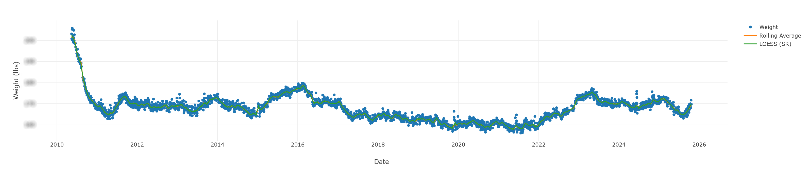

# body-stats

Tool for visualizing your weight (with a rolling average) over time.

# Usage

Store your weight in an Excel (.xslx) file, with the following format:

* Sheet name: `Weight`
* Columns
    * Measurement date
    * [unused]
    * Weight
    * Fat Weight
    * % Fat
    * % Water
    * % Bone
    * BMI

Currently, only the Measurement Date and Weight columns are used, but all columns must be present in the sheet for the
parser to work.  Sorry, I don't make the rules.  (Actually, I do, but I built this for my own weight tracking
spreadsheet.)

Once you have your weight stored in the sheet, run `cargo run -- your_sheet.xslx`.  This will produce a file,
`weight.html`, which provides an interactive graph of your weight along with both rolling average and
[LOESS](https://en.wikipedia.org/wiki/Local_regression) trendlines to help smooth otherwise noisy weight measurements.
